Nama : Kukoh Fatchu Rahman

NIM : 202110370311001

Kelas : Pemrograman Web B

Tugas Codelab

1.  Dari gambar tersebut DatabaseConfig di gunakan untuk menyambungkan kita ke database yang telah di buat di sini nama database saya adalah “praktikum_web5”.

    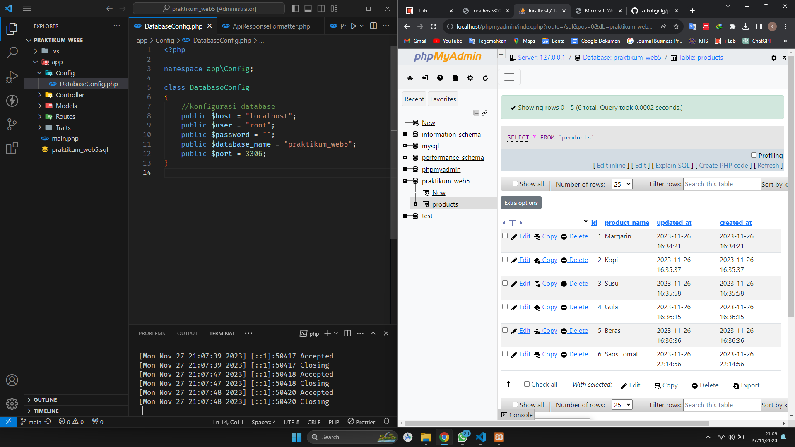

2.  Dari gambar tersebut Product bisa dikatakan adalah sebuah Model yang nantinya kita akan berinteraksi dengan database kita.

    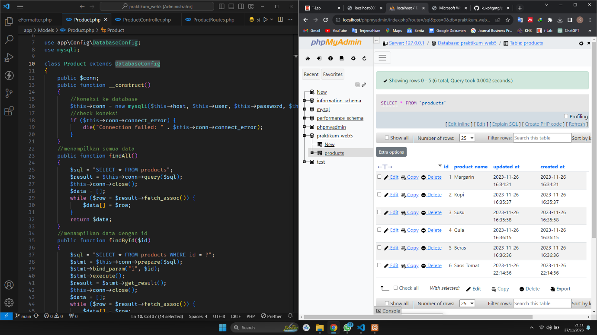

3.  Dari gambar tersebut ProductController berfungsi untuk memproses permintaan yang dilakukan melalui API kita.

    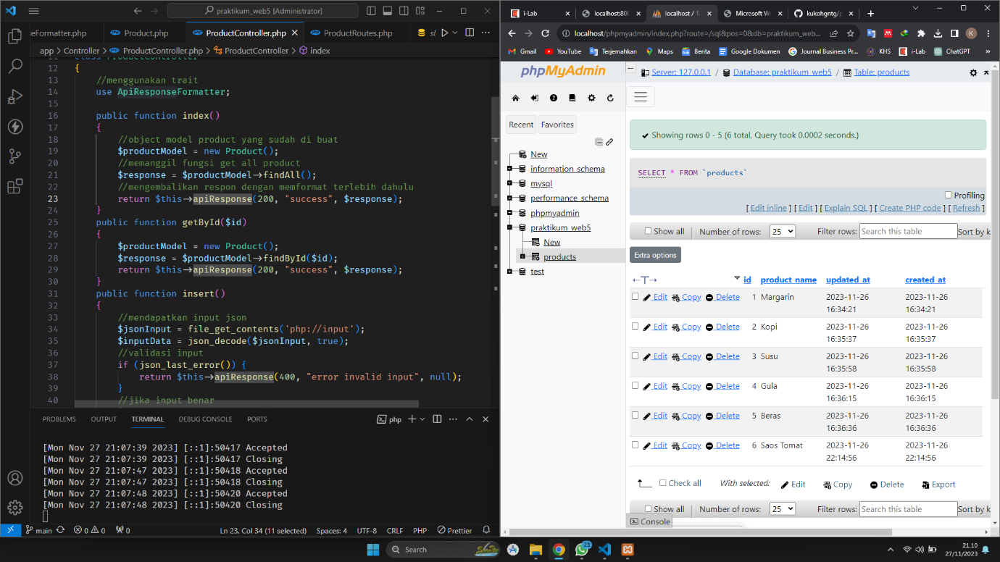

4.  Dari gambar tersebut ProductRoutes digunakan untuk mendifinikas alamat route API.

    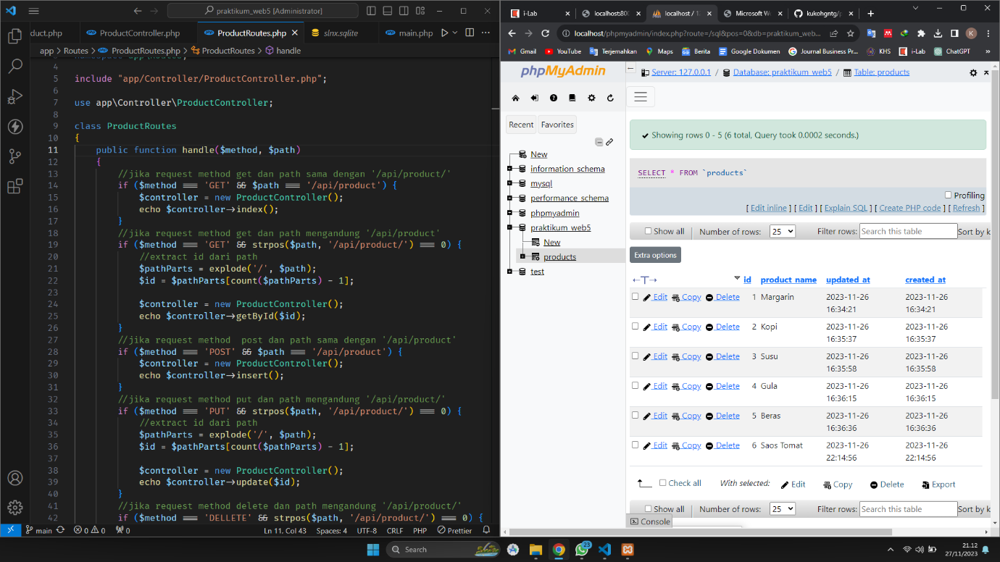

5.  Dari gambar tersebut ApiResponeFormatter digunakan untuk menformat data kita menjadi JSON.

    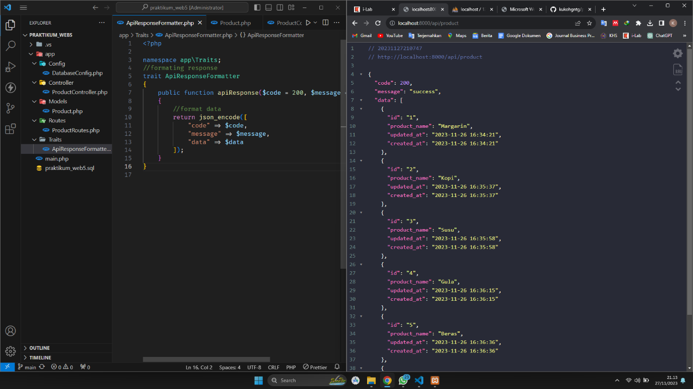

6.  Dari gambar tersebut Main digunakan untuk entrypoint.

    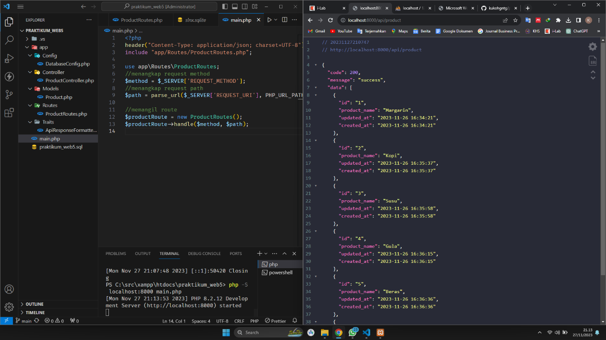

1.  Dari gambar tersebut GET Digunakan untuk mengakses data atau membaca data yang ada pada resource, di Postman mengaksese url <http://localhost:8000/api/product> yang artinya menjalankan fungsi findAll.

    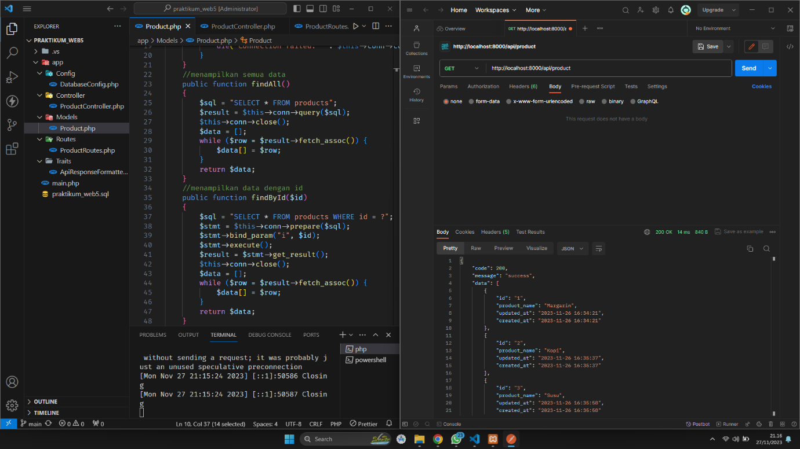

2.  Dari gambar tersebut GET Digunakan untuk mengakses data atau membaca data yang ada pada resource, di Postman mengaksese url <http://localhost:8000/api/product/1> yang artinya menjalankan fungsi findById.

    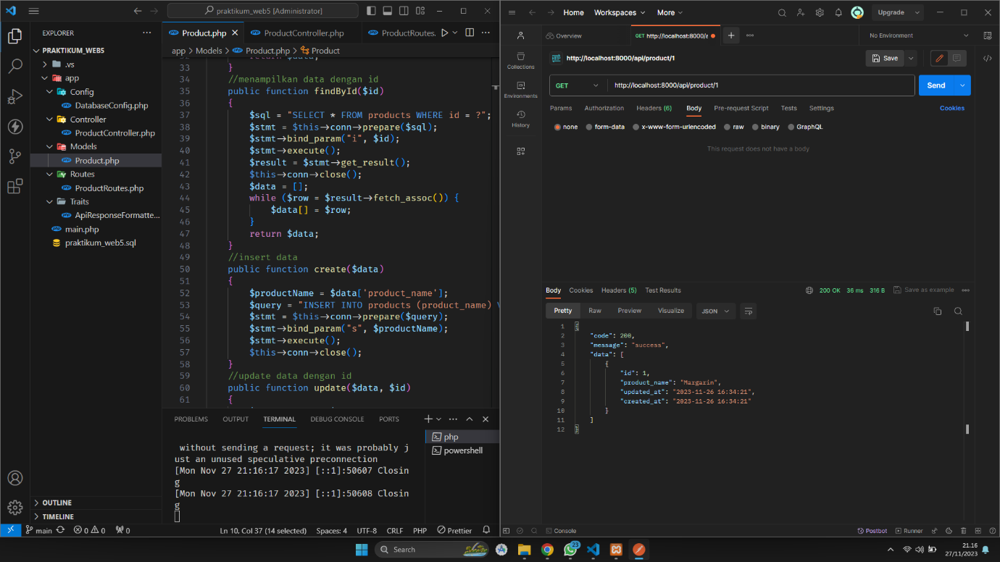

1.  Dari kedua gambar tersebut POST Digunakan untuk men-create atau membuat sebuah resource baru, di Postman mengaksese url <http://localhost:8000/api/product> yang artinya menjalankan fungsi create untuk membuat data baru di “product_name dengan nama Rokok” .

    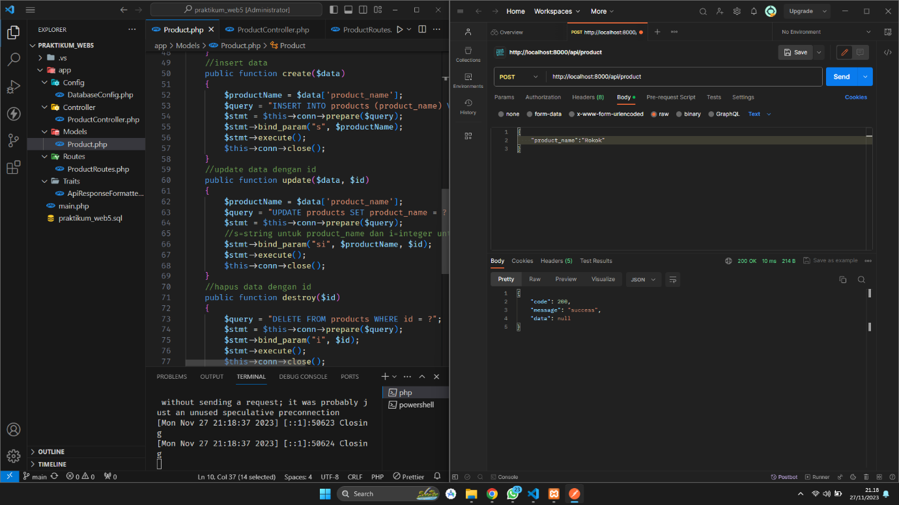1

    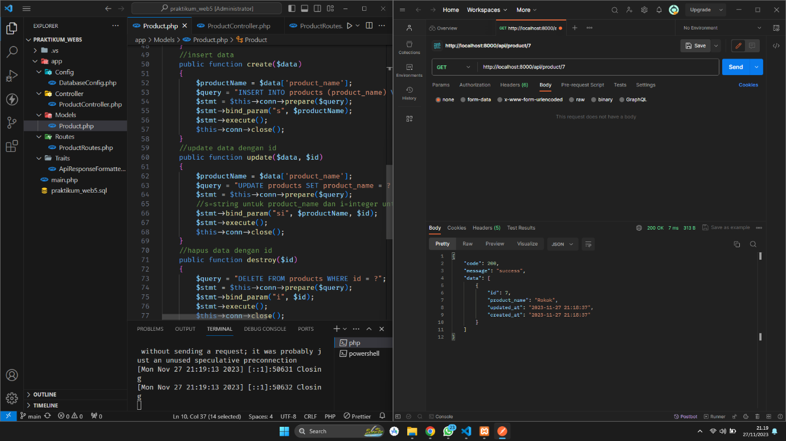2

1.  Dari gambar tersebut PUT Digunakan untuk memperbaharui sebuah resource, atau menambahnya, di Postman mengaksese url <http://localhost:8000/api/product/7> yang artinya menjalankan fungsi update untuk mengubah data 7 dari “product_name dengan nama Rokok” menjadi “product_name dengan nama Rokok Sampoerna Mild”.

    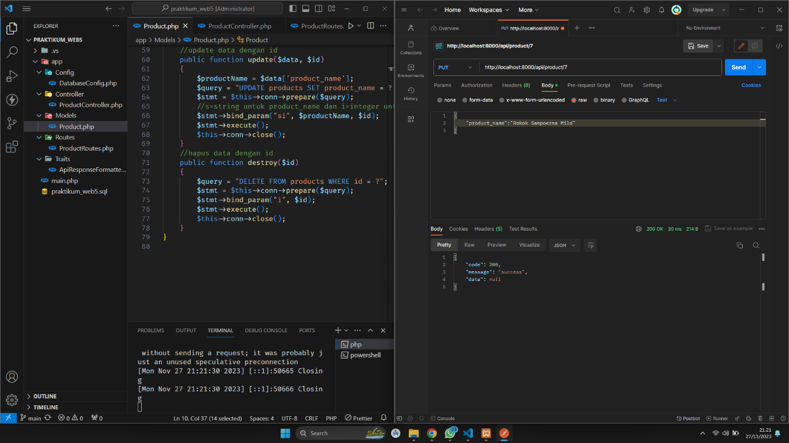

2.  Dari gambar tersebut DELETE Digunakan untuk menghapus resource, di Postman mengaksese url <http://localhost:8000/api/product/7> yang artinya menjalankan fungsi destroy untuk menghapus data 7.

    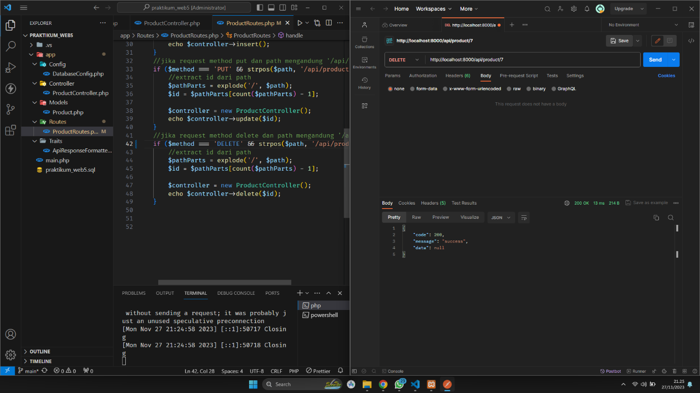

1.  Dari gambar tersebut GET Digunakan untuk mengakses data atau membaca data yang ada pada resource, di Postman mengaksese url <http://localhost:8000/api/product> yang artinya menjalankan fungsi findAll untuk mengetahui data 7 sudah terhapus.

    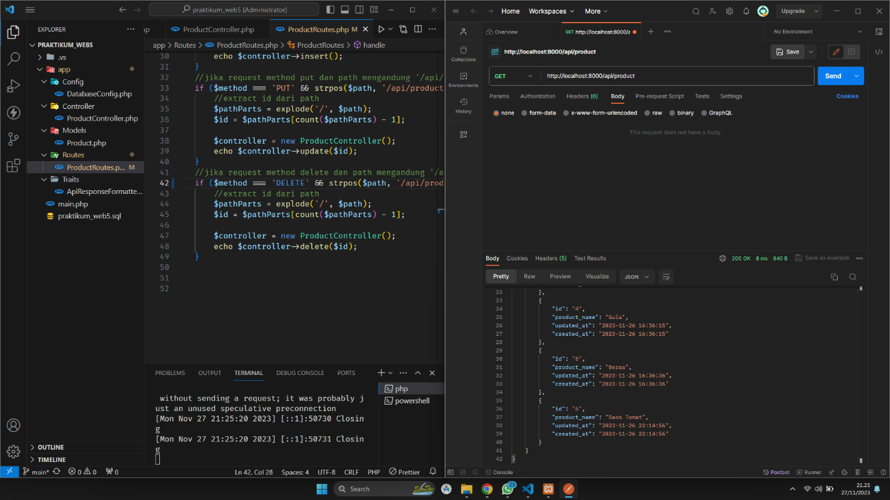
